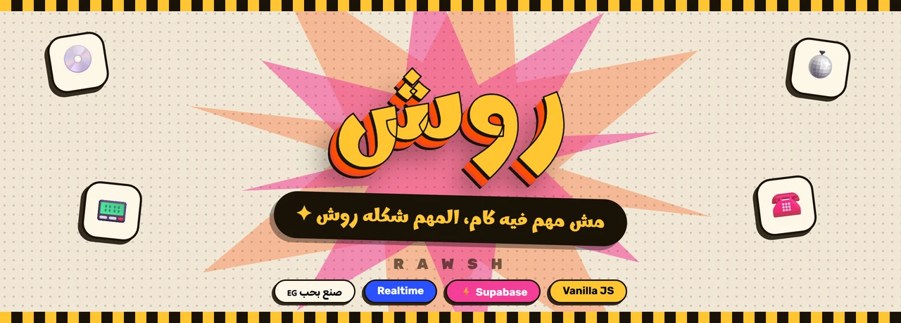
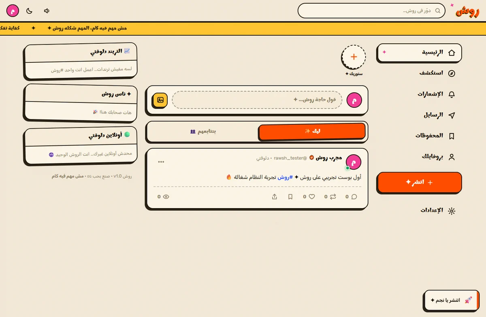
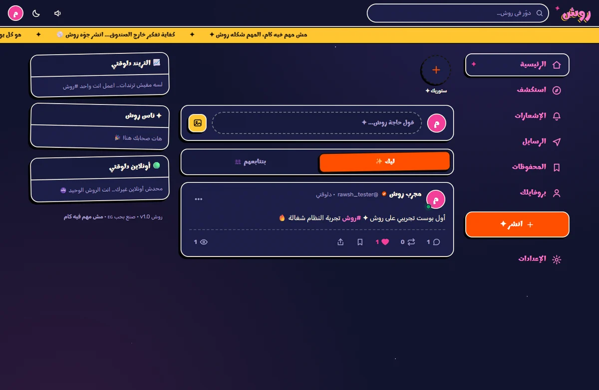
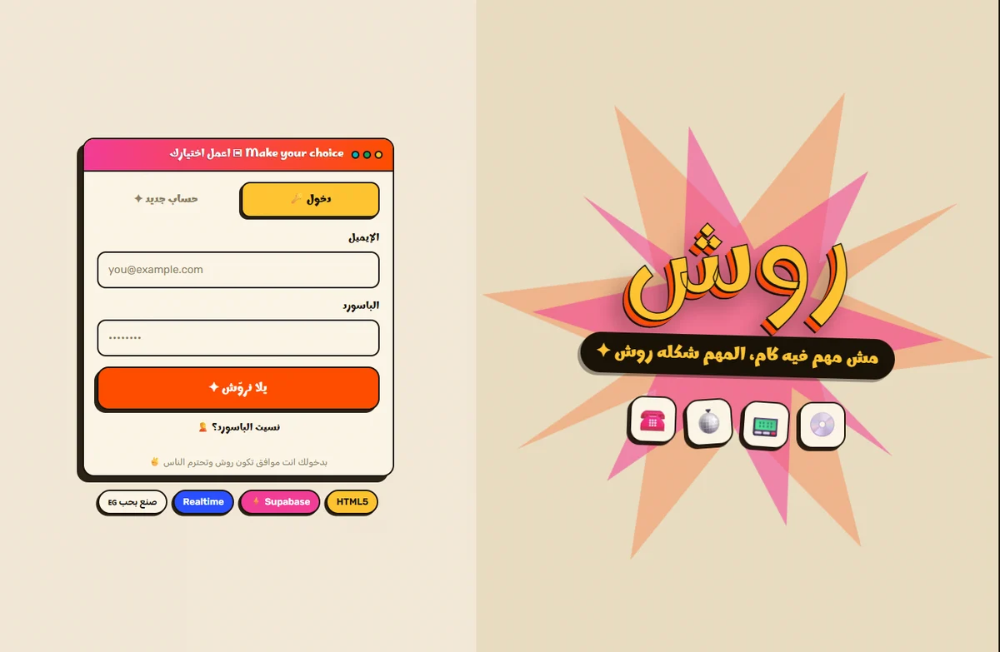
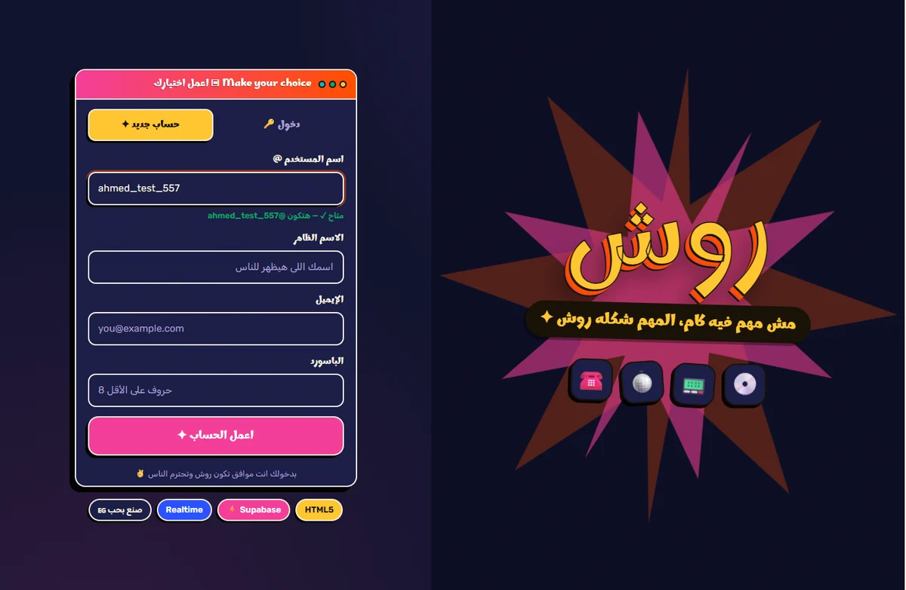
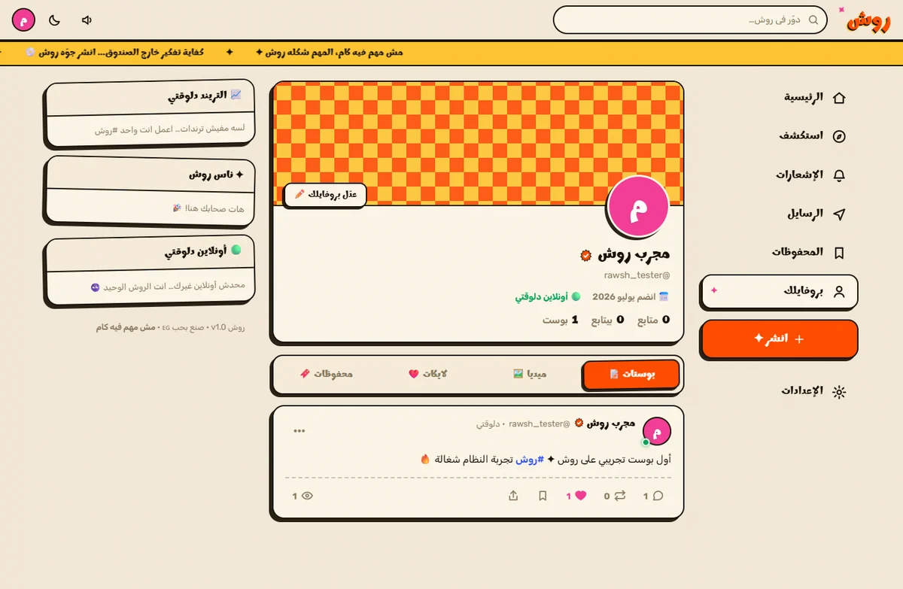
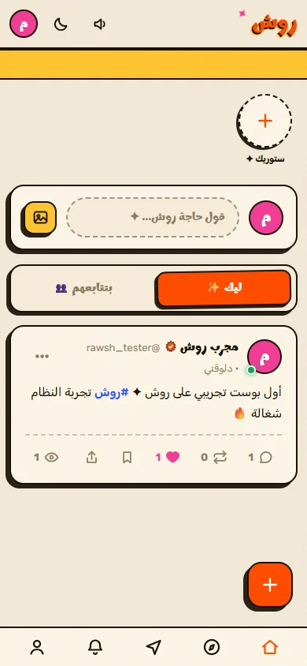

<div align="center">



<br>

**منصة سوشيال ميديا مصرية كاملة، بروح البوسترات الريترو، شغالة بجد.**

<br>

[](LICENSE)
[](https://supabase.com)
[](#-ليه-من-غير-framework)
[](docs/DEPLOYMENT.md)
[](../../actions/workflows/ci.yml)

<br>

[**✦ المميزات**](#-المميزات) &nbsp;·&nbsp;
[**🖼️ صور**](#️-الشكل) &nbsp;·&nbsp;
[**⚡ التشغيل**](#-شغّلها-في-دقيقة) &nbsp;·&nbsp;
[**🏗️ البنية**](docs/ARCHITECTURE.md) &nbsp;·&nbsp;
[**🗄️ الداتابيز**](docs/DATABASE.md) &nbsp;·&nbsp;
[**🎨 التصميم**](docs/DESIGN.md) &nbsp;·&nbsp;
[**☁️ الرفع**](docs/DEPLOYMENT.md)

</div>

<br>

---

## ✦ إيه روش؟

روش منصة سوشيال ميديا **كاملة وشغالة**، مش موك ولا بروتوتايب. بوستات، ستوريز، رسايل لحظية، استطلاعات، ترندات، إشعارات — كلها متوصلة بقاعدة بيانات حقيقية وشغالة زي ما المفروض.

اللي بيميزها إنها اتبنت بـ **HTML و CSS و JavaScript عادي** — من غير React، من غير build، من غير `node_modules` وقت التشغيل. الملفات اللي في الريبو دي بالظبط اللي بتشتغل في المتصفح.

وكل المنطق الحساس — العدادات، الإشعارات، ترتيب الفيد، الأمان — **جوه Postgres نفسه**، مش في الكلاينت.

<table>
<tr>
<td width="33%" align="center">

### 🎨
**هوية مش زي حد**

بوستر مصري ريترو اتحوّل لواجهة

</td>
<td width="33%" align="center">

### ⚡
**صفر build**

عدّل ملف، اعمل refresh، خلاص

</td>
<td width="33%" align="center">

### 🔐
**أمان من الداتابيز**

RLS على كل جدول، مفيش استثناء

</td>
</tr>
</table>

---

## ✦ المميزات

خلطة من أحسن اللي في كل منصة، بنكهة مصرية:

<table>
<tr><th width="150">من منين</th><th>اللي موجود</th></tr>

<tr><td valign="top"><b>X / تويتر</b></td><td>

بوستات نصية · **ريبوست** واقتباس · **استطلاعات رأي** بمدة ونتائج لحظية · هاشتاجات **عربي وإنجليزي** · ترندات آخر ٤٨ ساعة · منشنات `@` · عدادات مشاهدة

</td></tr>

<tr><td valign="top"><b>إنستجرام</b></td><td>

**ستوريز ٢٤ ساعة** (صورة / فيديو / نص ملوّن) · قايمة مين شافها · بروفايل بكوفر وأفاتار · جريد ميديا · شارة توثيق ✦

</td></tr>

<tr><td valign="top"><b>تيك توك</b></td><td>

فيد **"ليك"** بخوارزمية تفاعل + حداثة محسوبة في الداتابيز · فيديوهات بتتوقف تلقائيًا لما تخرج من الشاشة

</td></tr>

<tr><td valign="top"><b>واتساب</b></td><td>

**رسايل لحظية** · **رد** واقتباس · **تفاعلات** بالإيموجي · **تعديل** ونسخ · مؤشر "بيكتب دلوقتي…" · علامات قراءة ✓✓ · معاينة صورة بكابشن · إرسال متفائل · حالة أونلاين 🟢

</td></tr>

<tr><td valign="top"><b>سناب شات</b></td><td>

**ستريك النشر اليومي** 🔥 بيتحسب تلقائيًا في الداتابيز

</td></tr>

<tr><td valign="top"><b>روش</b></td><td>

إشعارات لحظية لـ ٨ أنواع تفاعل بتوست وصوت · بحث شامل (ناس / بوستات / هاشتاجات) · محفوظات خاصة · لايكات على التعليقات · ردود متداخلة · **وضع ليلي بسماء نجوم** · **أصوات ريترو مولّدة بـ Web Audio** · PWA قابلة للتثبيت

</td></tr>
</table>

> **كل العدادات بتتحدث بـ Triggers جوه Postgres.** الكلاينت مايقدرش يزوّد لايك أو متابع لنفسه حتى لو عدّل الكود — مفيش سياسة `UPDATE` على العدادات أصلًا.

---

## 🖼️ الشكل

<div align="center">

**الفيد — نهاري وليلي**




<br><br>

**شاشة الدخول — ديالوج ويندوز ونجمة بوستر**




<br><br>

<table>
<tr>
<td width="65%" align="center"><b>البروفايل</b><br><br></td>
<td width="35%" align="center"><b>موبايل</b><br><br></td>
</tr>
</table>

</div>

---

## ⚡ شغّلها في دقيقة

```bash
git clone https://github.com/Lord-shaban/rawsh.git
cd rawsh
npm install     # لأدوات الفحص بس — المشروع نفسه مالوش تبعيات
npm run dev     # ← http://localhost:8080
```

من غير npm خالص:

```bash
npx serve .
# أو
python -m http.server 8080
```

> ⚠️ **لازم سيرفر محلي.** فتح `index.html` مباشرة مش هيشتغل — المشروع بيستخدم ES Modules.

**التطبيق متوصل بمشروع Supabase جاهز** — يعني هيشتغل عندك على طول من غير أي إعدادات. لو عايز تربط مشروعك الخاص، شوف [دليل الرفع](docs/DEPLOYMENT.md#ربط-مشروع-supabase-بتاعك).

### الفحص

```bash
npm run check           # كل الـ imports بتتحل + CSS سليم + الملفات الأساسية موجودة
node scripts/smoke.mjs  # بيفتح الصفحة بمتصفح حقيقي ويتأكد إنها اترندرت ووصلت للداتابيز
```

---

## ✦ ليه من غير framework؟

مش عناد — قرار مبني على شكل المشروع:

| | |
| --- | --- |
| 🚀 **صفر build** | تعدّل ملف وتعمل refresh. مفيش انتظار ولا bundler |
| 🪶 **~160 KB** | كل كود التطبيق. Supabase SDK بييجي من CDN |
| ⏳ **عمر افتراضي طويل** | مفيش تبعيات تقدم أو تكسر. الكود ده هيشتغل بعد ٥ سنين زي النهارده |
| 🔍 **واضح** | تفتح `js/pages.js` تفهم الفيد بيتبني إزاي، من غير ما تعرف hooks ولا reactivity |
| ☁️ **رفع = نسخ ملفات** | أي استضافة static. مفيش سيرفر يتصان |

**الثمن:** مفيش reactive state تلقائي — بنعوّضه بـ event bus بسيط في `store`. تفاصيل القرار في [`docs/ARCHITECTURE.md`](docs/ARCHITECTURE.md).

---

## 🏗️ البنية باختصار

```
المتصفح                              Supabase
─────────                            ────────
index.html                           PostgREST ──┐
    │                                Realtime  ──┤
js/app.js  (راوتر بالهاش)             Auth      ──┼──→ Postgres
    ├── pages.js                     Storage   ──┘      • 16 جدول
    ├── stories.js                                      • Triggers (كل العدادات)
    ├── messages.js                                     • RPCs (الفيد، الترند)
    ├── compose.js                                      • RLS (كل الأمان)
    └── components.js
         │
      js/sb.js  ←── الطبقة الوحيدة اللي بتكلم برة
```

<details>
<summary><b>📂 شجرة الملفات</b></summary>

```
rawsh/
├── index.html                  نقطة الدخول (SPA)
├── manifest.webmanifest        إعدادات PWA
├── sw.js                       Service Worker
├── _headers  _redirects        إعدادات Cloudflare Pages
│
├── css/
│   ├── design.css              🎨 المتغيرات، الألوان، الأزرار، الخامات
│   ├── layout.css              الهيدر، النڤ، الجريد، الريسبونسڤ
│   └── components.css          البوست، الستوري، الشات، البروفايل
│
├── js/
│   ├── config.js               إعدادات Supabase وحدود التطبيق
│   ├── lib.js                  أدوات عامة (DOM، وقت، مودال، أصوات، ضغط صور)
│   ├── sb.js                   ⚡ طبقة البيانات + Realtime
│   ├── components.js           كارت البوست، الأفاتار، الأيقونات
│   ├── app.js                  الراوتر والشل والودجتس
│   ├── pages.js                الفيد، البوست، البروفايل، الإكسبلور، الإشعارات
│   ├── stories.js              الستوريز
│   ├── messages.js             الرسايل اللحظية
│   ├── compose.js              نافذة النشر
│   ├── auth.js                 الدخول والتسجيل
│   └── settings.js             الإعدادات وتعديل البروفايل
│
├── scripts/
│   ├── dev-server.mjs          سيرفر تطوير محلي
│   ├── check.mjs               فحص سلامة الكود
│   └── smoke.mjs               اختبار بمتصفح حقيقي
│
├── supabase/schema.sql         السكيما الكاملة
└── docs/                       ARCHITECTURE · DATABASE · DESIGN · DEPLOYMENT
```

</details>

---

## 🗄️ قاعدة البيانات

<table>
<tr><td width="50%" valign="top">

**١٦ جدول**
`profiles` · `posts` · `comments` · `likes` · `comment_likes` · `reposts` · `bookmarks` · `follows` · `post_hashtags` · `post_views` · `poll_votes` · `stories` · `story_views` · `conversations` · `messages` · `notifications`

</td><td width="50%" valign="top">

**٨ دوال RPC**
`feed_for_you` · `feed_following` · `trending_tags` · `who_to_follow` · `poll_vote` · `register_views` · `get_or_create_conversation` · `mark_conversation_read`

</td></tr>
</table>

**خوارزمية الفيد** — محسوبة في Postgres مش في المتصفح:

```
النقاط = (لايكات×3 + تعليقات×4 + ريبوستات×5 + مشاهدات×0.05 + 5)
         ÷ (العمر بالساعات + 2) ^ 1.35
```

**الأمان:** RLS متفعّل على كل جدول · الرسايل للأطراف بس · المحفوظات والأصوات سرية · الرفع مقيّد بفولدر كل مستخدم · دوال الـ Triggers محجوبة عن الـ API تمامًا.

📖 التفاصيل الكاملة في [`docs/DATABASE.md`](docs/DATABASE.md)

---

## 🎨 التصميم

الهوية مستوحاة من **بوسترات البوب-آرت المصرية الريترو** — ورق كريمي مجرّن، خط عربي تخين بظل ثلاثي الأبعاد، ستيكرز بحدود سودا وظل قاسي، نجوم وشطرنج وشرايط LED وديالوجات ويندوز قديمة. وفي الوضع الليلي، سماء نجوم.

<div align="center">

| | | | | | | |
|:-:|:-:|:-:|:-:|:-:|:-:|:-:|
|  |  |  |  |  |  |  |
| برتقالي | بينك | أزرق | أصفر | أخضر | ورق | حبر |

</div>

القاعدة الذهبية: **لو الحاجة تقدر تتزوّق شوية، زوّقها** — بس خليها مقروءة.

📖 نظام التصميم كامل في [`docs/DESIGN.md`](docs/DESIGN.md)

---

## ☁️ الرفع

أسرع طريقة — **Cloudflare Pages بالسحب والإفلات**:

1. [dash.cloudflare.com](https://dash.cloudflare.com) → **Workers & Pages** → **Create** → **Pages** → **Upload assets**
2. اسحب فولدر المشروع
3. **Deploy** 🎉

مفيش build command ولا إعدادات — الراوتنج بالهاش فمفيش 404.

📖 كل الطرق (Git، Actions، Vercel، Netlify) في [`docs/DEPLOYMENT.md`](docs/DEPLOYMENT.md)

---

## 🤝 المساهمة

أي مساهمة مرحّب بيها — من تصليح كلمة غلط لميزة كاملة.

اقرا [`CONTRIBUTING.md`](CONTRIBUTING.md) الأول: فيه فلسفة المشروع، ستايل الكود، وخريطة تقولك تعدّل فين بالظبط.

**أفكار محتاجة شغل:** جروبات ومجتمعات · إشعارات ويب · ضغط فيديو في المتصفح · دعم لغات تانية · تحسين الوصولية

---

## 📄 الترخيص

[MIT](LICENSE) — اعمل بيه اللي انت عايزه.

---

<div align="center">

<br>

### مش مهم فيه كام، المهم شكله روش ✦

<br>

صنع بحب في مصر 🇪🇬 بواسطة [**Ahmed Shaban**](https://github.com/Lord-shaban)

<br>

⭐ **لو عجبك المشروع، سيبله نجمة** ⭐

</div>
